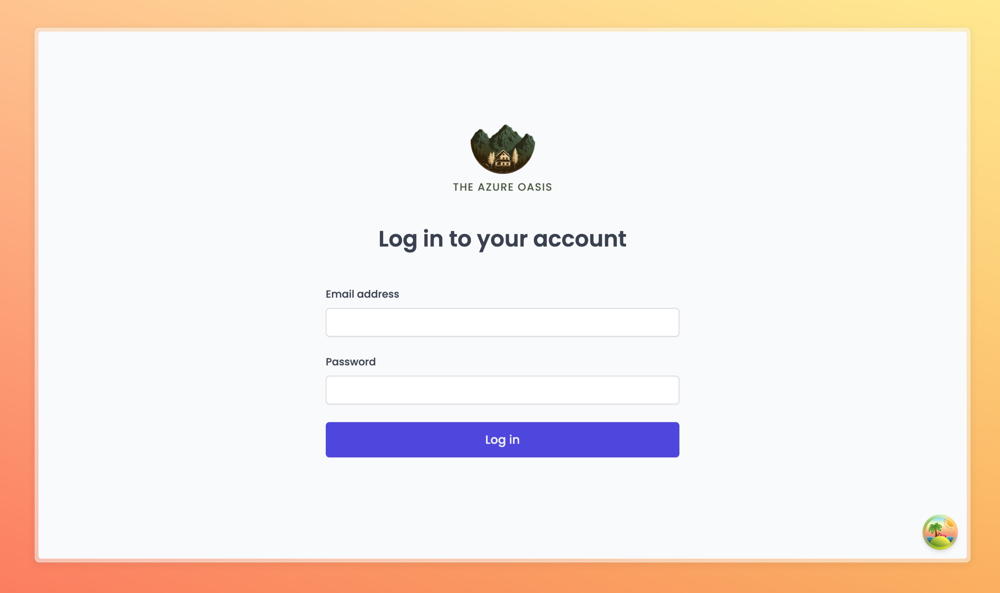
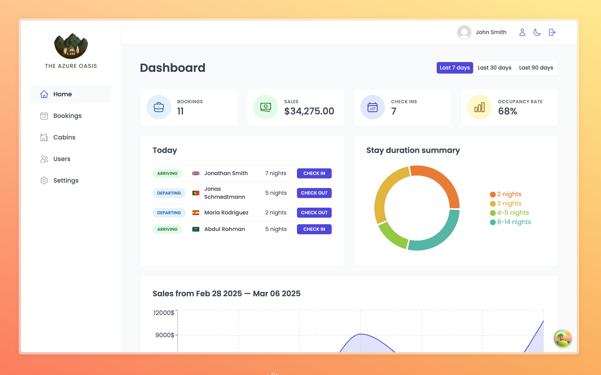

# The Azure Oasis - Internal Hotel Management

## 📌 About The Project

The **Azure Oasis** is a small boutique hotel with 8 luxurious wooden cabins. We built a **hotel management system** to manage everything seamlessly, from **bookings and guests to cabin availability.**

This is an **internal hotel management application** built using the **MERN stack** and **Supabase** as the backend service.

## 🚀 Features

✅ **Hotel Management** - Manage hotel bookings, guests, and cabins easily.  
✅ **User Authentication** - Secure login.  
✅ **Bookings System** - Check availability, assign cabins, and track guest check-in/check-out.  
✅ **Guest Management** - Store guest details and preferences for personalized service.  
✅ **Cabin Management** - Monitor and manage cabin occupancy in real-time.  
✅ **Supabase Integration** - Cloud database with authentication and real-time data sync.  
✅ **Dashboard Analytics** - Track hotel performance with insightful data visualization.

## 📷 Dashboard Preview

Since this is an **internal hotel management application**, use the following test credentials to log in:

- **Email:** user@azureoasis.com
- **Password:** user1234@

## 🛠 Tech Stack

- **Frontend:** React, React Router, Styled Components, Recharts
- **Backend:** Node.js, Express.js, Supabase
- **Database:** Supabase (PostgreSQL)
- **State Management:** TanStack React Query
- **Forms & Validation:** React Hook Form
- **UI & Icons:** Styled Components, React Icons
- **Others:** React Error Boundary, React Hot Toast, Date-fns

## 🛠 Future Enhancements

- Multi-user roles (Admin, Staff, Guest)
- Restaurant Table Booking System
- Payment Integration for online bookings
- Automated email notifications for bookings
- ✅ Dark mode UI support

## 🤝 Contributing

Contributions are welcome! Feel free to fork this repository and submit a pull request.

---

🚀 Start managing your hotel efficiently with The Azure Oasis Management System!

⭐ Star the repository if you find it useful! 🚀
